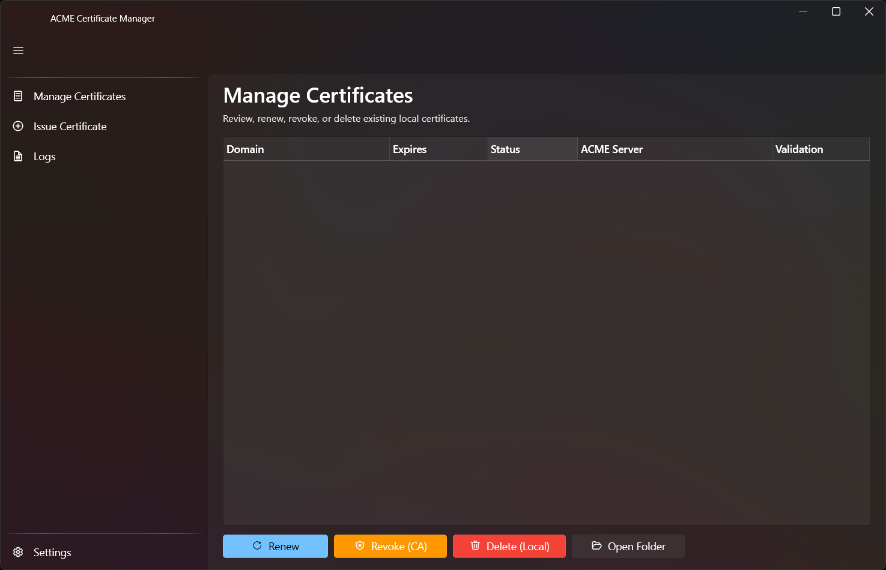
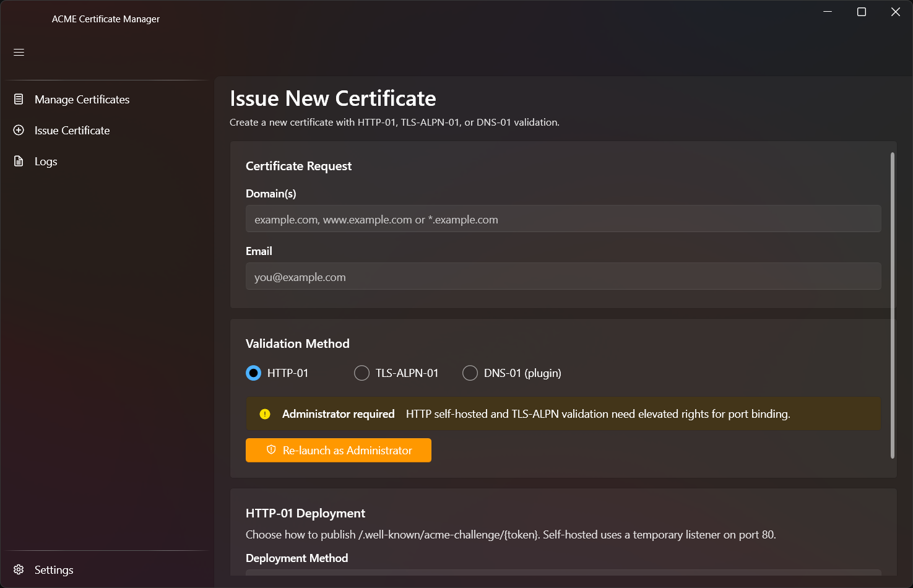
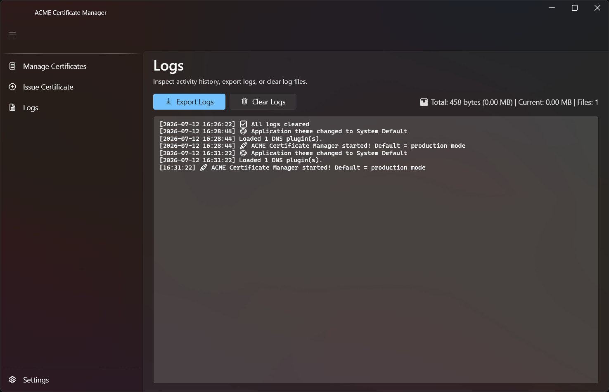
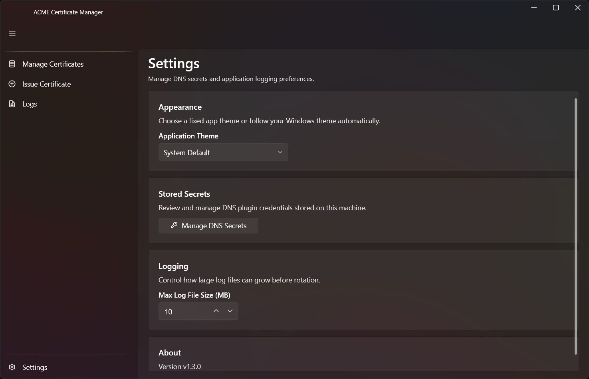

# ACME Certificate Manager

**The friendliest Windows app for free Let's Encrypt certificates**  

## ✅ Quick Start (30 seconds)
1. Download the latest package from **Releases** for your architecture (win-x86, win-x64, or win-arm64)
2. Extract the package and run `acm.exe`
3. Go to “Issue New Certificate” tab and click the big button

**Defaults to Let's Encrypt production** (real certificates). Use the advanced options in Issue New Certificate to switch to staging when testing.

## Requirements
- Minimum runtime for development and source builds: .NET 10 (net10.0-windows).
- Minimum SDK for local build/test/publish commands: .NET SDK 10.0.
- Windows 10/11.

## Features
- Dashboard with big friendly buttons
- Issue wizard (domains, wildcards, HTTP-01, TLS-ALPN-01, DNS-01 plugin workflow)
- Manage certificates (list, expiry, renew/revoke)
- Logs tab with colored output
- Runtime folders auto-created next to the executable (plugins/, logs/, certs/, storage/)
- Self-contained single .exe (runs on any Windows 10/11)

## Validation Method Guide
- HTTP-01: Best when your domain can serve `http://<domain>/.well-known/acme-challenge/<token>`. Self-hosted mode uses a temporary listener on port 80.
- TLS-ALPN-01: Best when HTTP routing is difficult but inbound TLS on 443 is available. The app runs a temporary TLS listener with the ACME ALPN challenge certificate on port 443.
- DNS-01 (plugin): Required for wildcard certificates and useful when ports 80/443 cannot be exposed.

How to choose:
1. Need a wildcard certificate (`*.example.com`) -> use DNS-01.
2. Can expose port 80 and want simplest web challenge -> use HTTP-01.
3. Can expose port 443 but not port 80 -> use TLS-ALPN-01.

Administrator requirement:
- Self-hosted HTTP-01 (port 80) and TLS-ALPN-01 (port 443) can require elevated privileges on Windows.
- Use the in-app **Re-launch as Administrator** link before issuing when prompted.

### Validation Failures (Quick Fixes)
- Port in use (`80` or `443`): stop the conflicting service (for example IIS, Nginx, Apache, or another local reverse proxy) and retry.
- Cannot reach challenge endpoint: verify inbound firewall/NAT rules for the selected method (`80` for HTTP-01, `443` for TLS-ALPN-01).
- DNS-01 not validating yet: wait longer for TXT propagation, then retry (some providers need several minutes).

## Screenshots

### Manage Certificates

### Issue New Certificate

### Logs

### Settings

## Runtime Folder Layout
At startup the app creates these folders beside the executable:
- plugins/ for DNS plugin DLL files
- logs/ for persistent log files
- certs/ for generated certificate files
- storage/ for account/config/secrets JSON files

Legacy root files are migrated to storage/ on startup.

Expected extracted structure:
- ACMECertManager/acm.exe
- ACMECertManager/plugins/
- ACMECertManager/logs/
- ACMECertManager/certs/
- ACMECertManager/storage/

## Updating to a New Release
Use an in-place upgrade so your certificates and settings stay intact.

Simple update steps:
1. Close ACMECertManager if it is running.
2. Download the new release package for your architecture.
3. Extract/copy the new files into your existing ACMECertManager folder.
4. Allow overwrite of app binaries (including acm.exe).
5. Make sure these folders are still present after update: plugins/, logs/, certs/, storage/.
6. Launch acm.exe.

What is preserved on upgrade (if you keep the same folder):
- certs/ (issued certificate files)
- storage/certificates.json (certificate list/metadata)
- **storage/acme-account-production.pem** and **storage/acme-account-staging.pem** (environment-specific ACME account keys)
- storage/dns-secrets.json (saved DNS plugin credentials)
- storage/ui-settings.json (UI settings)
- logs/ (log history)
- plugins/ (DNS plugin DLLs you added)

What can be lost:
- If you delete the old folder before copying the new release, you lose local data unless you backed up and restored certs/, storage/, logs/, and plugins/.
- If certs/ is missing but storage/certificates.json exists, entries may remain but certificate files referenced by those entries may be missing.

## DNS-01 Plugin Workflow
1. Put provider DLLs in plugins/.
2. Launch the app and open Issue New Certificate.
3. Select DNS-01 and choose a plugin from the dropdown.
4. Fill required plugin fields.
5. Issue certificate.

Operational sequence:
1. Download the pre-built package for your architecture (x86, x64, ARM64).
2. Extract the ACMECertManager directory from the archive.
3. Verify acm.exe, plugins, logs, certs, and storage exist.
4. Place desired DNS plugin DLLs into plugins/.
5. Start the app to auto-scan and load plugin DLLs.
6. Choose DNS-01 and select the plugin from the DNS dropdown.
7. Enter plugin-required credentials and provider data.
8. After issuance, certificate files are saved in certs/ and shown in Manage Certificates.
9. Use Revoke Selected (CA) and Delete Selected (Local) for certificate lifecycle actions.

Warning: DNS plugin secrets are currently stored in plaintext in storage/dns-secrets.json.

Saved DNS credentials now default to the current certificate hostname as Domain/Context when available. Blank Domain/Context is only used when no hostname is provided.

Advanced ACME options (Issue New Certificate):
- Choose private key algorithm: RSA 2048 (RS256, default), ECDSA P-256 (ES256), or ECDSA P-384 (ES384).
- Use Let's Encrypt staging server for test issuance.
- Optionally override with a custom ACME directory URL.
- Certificate expiry is read from the issued certificate's NotAfter value (not a fixed 90-day estimate).

Certificate output and visibility:
- Certificate files are saved under `certs/{domain}/{MM-dd-yyyy}/` (for example `certs/nas.yawnee.net/02-08-2026/`).
- Re-issuing the same domain creates a new dated folder so previous certificate files are preserved.
- If PFX output is selected, issuance now validates that certificate.pfx was actually created.
- Issued certificates are persisted to storage/certificates.json and immediately reloaded into the Manage Certificates grid.

## How to Get Your .exe (2 ways)

**Way 1 – Easiest (GitHub Release assets)**
- Go to **Releases** and download the archive for your architecture:
	- ACMECertManager-vX.Y.Z-win-x86.zip
	- ACMECertManager-vX.Y.Z-win-x64.zip
	- ACMECertManager-vX.Y.Z-win-arm64.zip

**Way 2 – Build yourself**
1. Install free **Visual Studio Code** with .NET 10 support (or install .NET SDK 10.0).
2. Open `ACMECertManager.sln`
3. Press **F5** to run immediately
4. To create single .exe: right-click project → Publish → self-contained win-x64 → Publish

## CI and Release Workflows
- `.github/workflows/ci.yml`
	- Runs on push to main and develop, and on pull requests.
	- Guarded by paths: only runs when `src/**`, `tests/**`, `samples/**`, or `.github/workflows/**` changes.
	- Validates restore, build, and tests only.
	- Uses .NET 10.
- `.github/workflows/release.yml`
	- Runs only when a tag is pushed (format: vMAJOR.MINOR.PATCH).
	- Builds release packages for win-x86, win-x64, and win-arm64.
	- Publishes zipped assets to GitHub Releases.
	- Publishes stable (non-prerelease) releases.

## Versioning and Release Process
- Stable release workflow enforces SemVer tags in this format: `vMAJOR.MINOR.PATCH`.
- The app version metadata is automatically set by workflow at build time.

Release steps:
1. Develop and test changes on the `develop` branch.
2. Open a pull request from `develop` to `main` and merge when ready.
3. Create and push a release tag, for example:
	 - `git tag v1.0.0`
	 - `git push origin v1.0.0`
4. GitHub Actions runs the release workflow and publishes release assets.

Version bump guidance:
- Patch update (bug fixes): `v1.0.1`
- Minor update (new backward-compatible features): `v1.1.0`
- Major update (breaking changes): `v2.0.0`

## Contributing Notes
- Docs-only changes (for example README or LICENSE updates) intentionally do not trigger CI.
- CI runs only when code/test/sample/workflow paths change, based on workflow path guards.
- If you need a full validation run for a docs PR, include a small relevant workflow change or run local checks before opening the PR.

## Security Tips
- Production is the default. Use staging from advanced options when testing to avoid rate limits.
- Run as Administrator when using self-hosted HTTP-01 (port 80)
- For TLS-ALPN-01 (port 443), admin rights are not normally required; if it fails, check for port conflicts or other listener/startup issues
- Certificates auto-saved in `certs/` folder
- DNS plugin credentials are stored unsecured (plaintext) in `storage/dns-secrets.json`

## Plugin Development
See PLUGIN_DEVELOPMENT.md for instructions on building custom DNS plugin DLLs.

Sample implementation included: samples/HurricaneElectricDnsPlugin

**License:** GPL v3  

Repo: https://github.com/caveman8080/ACMECertManager
