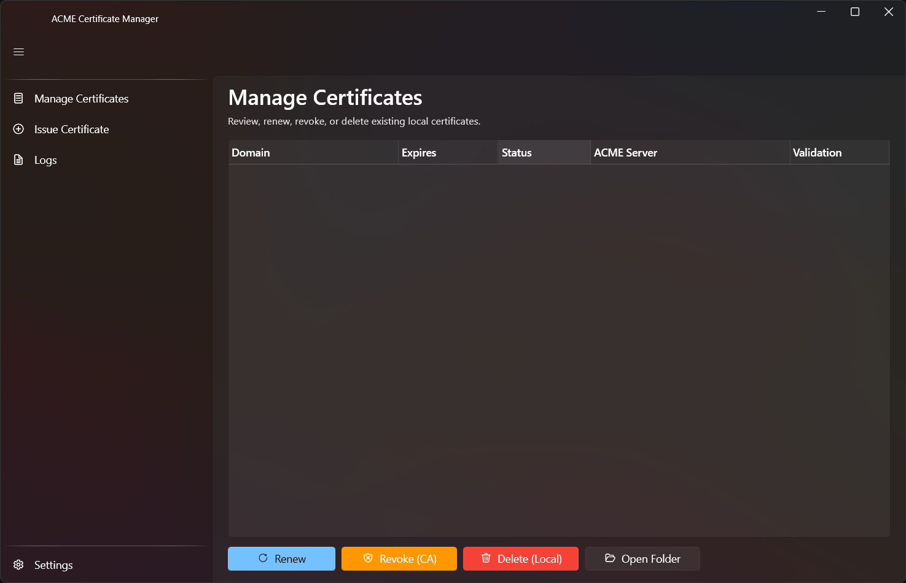
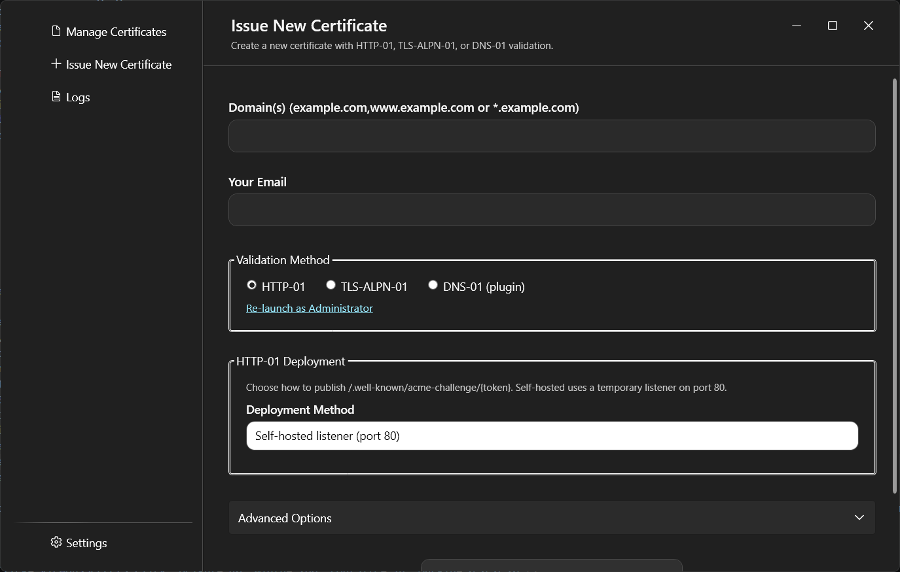

# ACME Certificate Manager

A small Windows program for someone who only needs two or three certificates. Use it for a NAS, a webcam, or a page you host yourself. You do not need scripts, and you do not need to install Certbot. It is for everyday personal use, not for a business.

It talks to Let's Encrypt (through the Certes library) and saves the certificate files next to the program.

1. It issues a certificate to you.
2. It lists the certificates this program has issued, so you can see them, open their folder, revoke one, or delete the local files.
3. Manage Certificates has a Renew button. Clicking it only writes a log line. It does not issue a new certificate.
4. It is portable. Unzip it and run `acm.exe`. Nothing to install.
5. It is for home use. It is not a business or company product.

## Get the portable build

Releases are Windows only: `win-x86`, `win-x64`, and `win-arm64`. There is no Mac or Linux build.

1. Open [Releases](https://github.com/caveman8080/ACMECertManager/releases).
2. Download the zip for your PC. Most people want `ACMECertManager-vX.Y.Z-win-x64.zip`. The other names are `win-x86` and `win-arm64`.
3. Unzip it. Open the `ACMECertManager` folder and run `acm.exe`.

The zip already contains what the program needs to run. You do not install .NET, and you do not run an installer.

The program keeps its files in folders beside `acm.exe`:

- `plugins/` for DNS plugin files
- `logs/` for the log
- `certs/` for certificate files
- `storage/` for the list of certificates, account keys, and settings

To use a newer zip without losing what you already have:

1. Close the program.
2. Unzip the new zip into the same `ACMECertManager` folder and allow it to replace `acm.exe`.
3. Leave `plugins/`, `logs/`, `certs/`, and `storage/` in place.

If you delete the old folder first, you lose those files unless you copied them somewhere else.

## Issue a certificate

Open **Issue New Certificate**, type the name (for example `nas.example.com`), and choose how Let's Encrypt checks that the name is yours.

- **HTTP-01.** The usual choice when this PC can answer on port 80 for a minute. Port 80 must be free. Stop anything else that is using it, such as another web server, then try again. The program may ask you to run it as Administrator. If this PC is not the one the internet reaches, you can instead have the program place the check file in a folder, or send it by FTP, SFTP, WebDAV, or a web address.
- **TLS-ALPN-01.** Use this when port 80 is not available but port 443 is. Port 443 must be free while the check runs. The program may ask you to run it as Administrator. This does not install the certificate into Windows, and it does not attach it to an IIS site.
- **DNS-01.** Use this for a wildcard name such as `*.example.com`, or when ports 80 and 443 cannot be opened. You need a DNS plugin (see below). A wildcard name only works with DNS-01.

The program uses the real Let's Encrypt service unless you turn on the staging (test) option. Staging certificates are not trusted by browsers. You can also type a different ACME directory address if you already have one.

You can leave the key as RSA 2048 (RS256), or pick ECDSA P-256 (ES256) or ECDSA P-384 (ES384). Check **Also create a PFX file (certificate.pfx)** only if you want a `.pfx` file as well as the PEM files. The PFX file is saved with no password.

After it finishes, the certificate shows up under **Manage Certificates**. That list is only what this program has issued. It does not read the Windows certificate store.

## Files you get

Each issue is saved under `certs/{name}/{MM-dd-yyyy}/` next to `acm.exe`. Example: `certs/nas.example.com/10-04-2026/`.

You get:

- `cert.pem`
- `chain.pem`
- `fullchain.pem`
- `privkey.pem`
- `certificate.pfx`, only if you asked for a PFX file

Issuing the same name again makes a new dated folder. If you issue it twice on the same day, the second folder gets a `-2` (then `-3`, and so on). Older files are left alone.

A wildcard name such as `*.example.com` is stored in a folder named `wildcard.example.com`. For DNS-01, the TXT record name drops a leading `*.`, so the record is `_acme-challenge.example.com`, not `_acme-challenge.*.example.com`.

**Manage Certificates** can open that folder, revoke the certificate at Let's Encrypt (this needs `privkey.pem`), or delete the local files. Deleting local files does not revoke the certificate. The list itself is kept in `storage/certificates.json`.

DNS plugin passwords are stored as plain text in `storage/dns-secrets.json`. Keep that folder private.

## DNS plugins

You only need a plugin for DNS-01, including wildcard names.

1. Download a plugin zip from [ACMECertManager-DnsPlugins](https://github.com/caveman8080/ACMECertManager-DnsPlugins) Releases.
2. Put the DLL in the `plugins` folder next to `acm.exe`.
3. Start the program, choose DNS-01, pick the plugin, and fill in the fields it asks for.

If you want to write your own plugin, see [docs/PLUGIN_DEVELOPMENT.md](docs/PLUGIN_DEVELOPMENT.md).

## Renewal

On **Manage Certificates**, select a certificate and click **Renew**.

The button writes a log line and stops. It does not fill in a new request from the choices you used the first time, and it does not write a new certificate. Nothing renews on a schedule while the program is closed.

The list does keep the name, the end date, which check was used (HTTP-01, TLS-ALPN-01, or DNS-01), and which Let's Encrypt address was used. Renew does not use those facts to issue again. To get a new certificate, open **Issue New Certificate** and fill in the form again.

The program also does not install the certificate into Windows or bind it in IIS. Copy the files onto the NAS, camera, or site yourself, the way that device asks you to.

## Build from source

This section is for people changing the program. The zip above is enough if you only want certificates.

- Windows 10 or 11, and the .NET 10 SDK.
- License: GPL-3.0. See [LICENSE](LICENSE).
- Build and run: `dotnet build ACMECertManager.sln` then `dotnet run --project src/ACMECertManager.csproj`.
- A version tag shaped like `v1.2.3`, pushed from `main`, builds the three Windows zips and publishes them on Releases.
- How to contribute: [CONTRIBUTING.md](CONTRIBUTING.md).
- How to report a security problem: [SECURITY.md](SECURITY.md).
